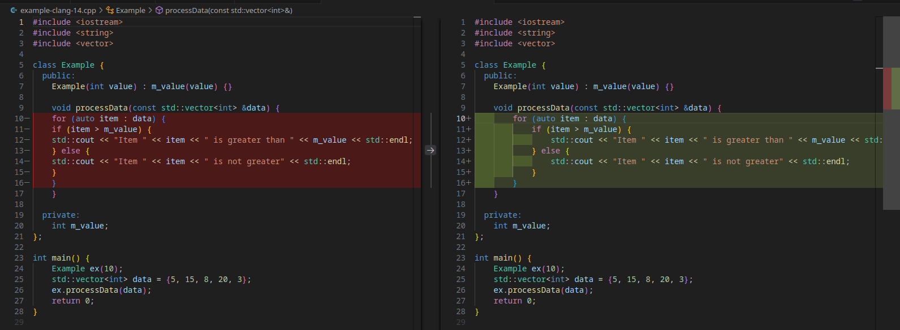

# Clang-format

## About

A fast, portable solution for building and using multiple versions of clang-format across different Linux distributions. Docker-based approaches are equivalent but much slower and resource-intensive.

## Features

- [x] Ready-made `clang-format` that lints cpp/hpp files using Clang style versions 11 to 20
- [x] Works on any Linux distribution (Ubuntu, CentOS, Fedora, Arch, openSUSE)
- [x] Much faster than Docker-based solutions
- [x] GitHub Actions integration
- [x] Automatic dependency detection and installation
- [x] Tractable build process with available source code

## Quick Start

### Use the compiled binaries with GitHub Actions

Use the [Marketplace extension](https://github.com/marketplace?type=actions) for GitHub Actions. This approach will format and ammend your commits/PRs automatically.

```yaml

```

### Use the compiled binaries on your system

Download the latest release from the [Releases](https://github.com/pachadotdev/clang-format/releases) page and extract the binaries to `/usr/local/bin` or any directory in your PATH.

```bash
wget 
COMPLETE AFTER PUSH

clang-format example.cpp # defaults to clang-format-19, overwrites the file
clang-format 11 example.cpp # uses clang-format-11, overwrites the file
clang-format 14 example.cpp --suffix "-clang-14" # creates a new file example-clang-14.cpp

clang-format # lints all cpp/hpp files in the current directory and subdirectories
```



## Build specific version(s)

The provided Makefile will automatically detect your Linux distribution and install the required dependencies (e.g., make, git, gcc14/15+, etc.)

Here is the output of `make help`:

```bash
make help                                                        ✔ 
Clang-format Multi-version Builder

Available targets:
  all           - Build all clang-format versions
  clang11       - Build clang-format-11
  clang12       - Build clang-format-12
  clang13       - Build clang-format-13
  clang14       - Build clang-format-14
  clang15       - Build clang-format-15
  clang16       - Build clang-format-16
  clang17       - Build clang-format-17
  clang18       - Build clang-format-18
  clang19       - Build clang-format-19
  clean         - Clean all build artifacts

Usage examples:
  make clang14                    # Build clang-format-14 (auto-installs deps + gcc14)
  make clang18                    # Build clang-format-18 (auto-installs deps)
  make all                        # Build all versions

Build features:
  - Auto-installs dependencies (cmake, ninja, git, python3)
  - Auto-installs GCC 14 for LLVM 11-14 (better compatibility)
  - Builds only clang-format tool (not entire clang)
  - Minimal LLVM targets and disabled tests/docs for faster builds
  - Uses all CPU cores: 8
  - C++17 for older LLVM versions (11-16), C++20 for newer (17+)
```

## Supported Linux Distributions

The build system automatically detects and works with:

- **Ubuntu/Debian**: Uses `apt-get`
- **CentOS/RHEL**: Uses `yum`
- **Fedora**: Uses `dnf`
- **Arch Linux**: Uses `pacman`
- **openSUSE**: Uses `zypper`

## Contributing

1. Open an issue to report bugs or suggest features
2. Send me a Pull Request
3. Test with multiple Linux distributions
4. Spread the word
5. Donate if you find it useful [](https://www.buymeacoffee.com/pacha)

## License

This project is released under the Apache 2.0 License. I do not have control over the Clang project, it is also released under the Apache 2.0 License and its property rights belong to [LLVM](https://llvm.org/).
